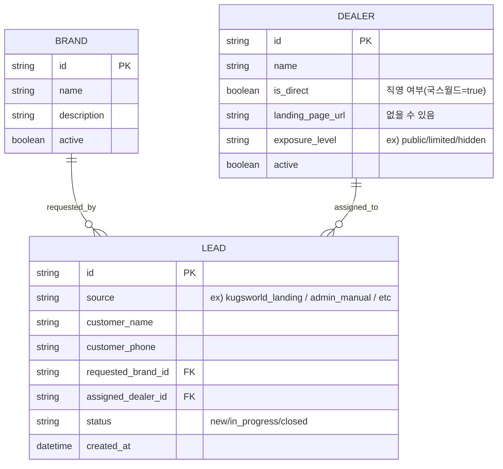
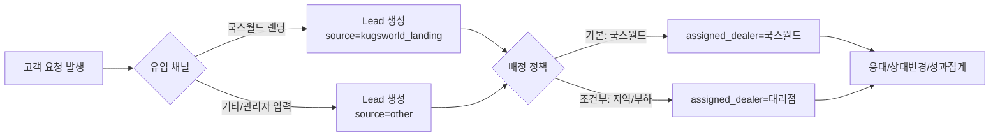

# 파나픽셀(공급사) / 국스월드(시공사) 관리 구조 제안서

## 1) 배경
- **파나픽셀**: 틴팅 필름 **공급사/브랜드(본사)** 역할
- **국스월드**: 파나픽셀이 직영으로 운영하는 **시공사(대리점 역할)**  
  - 별도의 **랜딩페이지**가 존재하고, 고객 요청(리드)이 유입됨
- 기타 대리점 중에도 파나픽셀 필름을 공급받는 곳이 있으나, 현재는 **개별 랜딩페이지 없이 제한적으로 운영**됨

## 2) 현 기획(“국스월드+파나픽셀을 하나의 페이지로 관리”)에서 발생 가능한 문제
- **도메인 혼합**: 공급(브랜드/정책/제품)과 시공(업체/일정/지역/응대)이 한 엔티티에 섞이면 필드/권한/정책이 쉽게 꼬임
- **권한/운영 분리의 어려움**: 본사 관점(상품/정책)과 시공팀 관점(리드 응대/배정/성과)이 한 화면에 섞여 책임 주체가 불명확해질 수 있음
- **리드 분석의 불명확성**: “국스월드 랜딩 유입”과 “대리점 배정 리드”가 섞이면 채널별 KPI(전환율, 응대속도, 배정 성공률)를 보기 어려움
- **확장성 저하**: 향후 직영 지점 추가/대리점 랜딩 생성/채널 다변화 시 예외 규칙이 증가

## 3) 제안 요약(추천 방향)
> **국스월드를 ‘대리점(시공사) 엔티티’로 두고, ‘직영/본사 운영’과 ‘랜딩/유입채널’을 별도로 모델링**합니다.  
> 파나픽셀은 **공급사/브랜드(본사)**로 분리합니다.

핵심 포인트:
- “**시공을 수행하는 주체 = 대리점(시공사)**”로 통일 → 국스월드도 동일 규칙에 포함
- 국스월드의 특수성(직영, 랜딩 유입)은 **플래그/채널/설정 값**으로 표현
- 리드는 “어디서 들어왔는지(source)”와 “누가 처리하는지(assigned dealer)”를 분리 → 운영/분석이 쉬워짐

## 4) 목표 아키텍처(도메인 모델)

### 4.1 엔티티 정의(개념)
- **Brand(파나픽셀)**: 제품(필름 라인업), 정책(가격정책/보증), 파트너 프로그램 등 “공급사/브랜드” 정보
- **Dealer(대리점/시공사)**: 시공을 수행하는 업체(국스월드 포함)
  - `is_direct`(직영/본사운영), `landing_page_url`, `exposure_level`(노출등급/제한) 등 속성으로 차이를 관리
- **Lead(고객 요청)**: 고객이 남긴 요청 데이터
  - `source`(국스월드 랜딩, 기타 유입 등)
  - `requested_brand_id`(관심 브랜드/필름)
  - `assigned_dealer_id`(처리 담당 대리점: 국스월드 또는 다른 대리점)

### 4.2 Mermaid ER 다이어그램(권장 구조)

## 5) 리드 흐름(운영 시나리오)

### 5.1 국스월드 랜딩 유입(현재 3번 요구사항 반영)
- 고객은 **국스월드 랜딩페이지**에서 요청 생성
- 생성된 리드는 `source = kugsworld_landing`
- 기본 정책:
  - (안 A) **무조건 국스월드 배정**: `assigned_dealer_id = 국스월드`
  - (안 B) 상황별 배정 가능: 내부 정책(지역/예약/부하)에 따라 대리점으로 배정

### 5.2 기타 대리점(현재 4번: 랜딩 없음/제한적)
- “랜딩페이지 유무”가 아니라 **노출/유입 채널 정책**으로 제한을 표현
  - 예: `exposure_level = limited` → 검색/추천/배정 대상에서 제한적으로만 노출

## 6) 어드민 화면 구성 제안(정보 책임 주체 기준)
- **브랜드/공급(파나픽셀) 관리**
  - 제품/필름 라인업, 정책(보증/가이드), 파트너 정책 등
- **대리점(시공사) 관리**
  - 대리점 목록/상세, 지역/연락처/상태
  - 국스월드는 여기 포함하되 `is_direct=true`, `landing_page_url` 등으로 구분
- **리드(고객 요청) 관리**
  - 유입(source) 필터, 배정(assigned dealer), 상태(status), SLA(응대시간) 등 운영 지표 중심

## 7) 기대 효과
- **논리 일관성**: “시공 주체=대리점”으로 통일 → 국스월드도 예외 없이 처리
- **확장성**: 직영 지점 추가, 대리점 랜딩 추가, 유입채널 다변화에도 모델 유지
- **운영/분석 용이**: source vs assigned를 분리해 KPI/리포트/정책 운영이 쉬움
- **권한 설계 용이**: 본사(브랜드/정책) vs 시공 운영(리드/배정/대리점) 역할 분리가 자연스러움

## 8) 리스크 및 대응
- **“한 페이지로 관리”의 단순함이 줄어든다는 우려**
  - 대응: UI는 “대시보드/리드”를 중심으로 통합 제공하되, 데이터 모델은 분리(사용자 체감은 단순, 내부는 확장형)
- **국스월드가 특별한 정책을 계속 요구할 가능성**
  - 대응: 특별함은 엔티티 분리가 아니라 `is_direct`, `landing_page_url`, `routing_rule`(배정 규칙) 같은 설정으로 흡수

## 9) 결정이 필요한 질문(합의 포인트)
1. 국스월드 랜딩 리드는 **항상 국스월드가 처리**하나요? 상황에 따라 **다른 대리점으로 배정**하나요?
2. 고객이 요청하는 대상은 “국스월드 시공”인가요, “파나픽셀 필름(브랜드)”인가요, **둘 다**인가요?
3. 대리점이 향후 **자체 로그인/권한(대리점 포털)**이 필요할 가능성이 있나요?

## 10) 결론
**파나픽셀(공급/브랜드)과 국스월드(시공/대리점)를 분리**하고, 국스월드의 특수성은 **직영 플래그 + 랜딩/유입채널 + 배정정책**으로 표현하는 구조가 가장 안정적입니다.  
이 방식은 현재 요구(국스월드 랜딩 리드)도 충족하면서, 향후 대리점/채널 확장 시에도 기획/개발/운영 비용을 최소화합니다.

